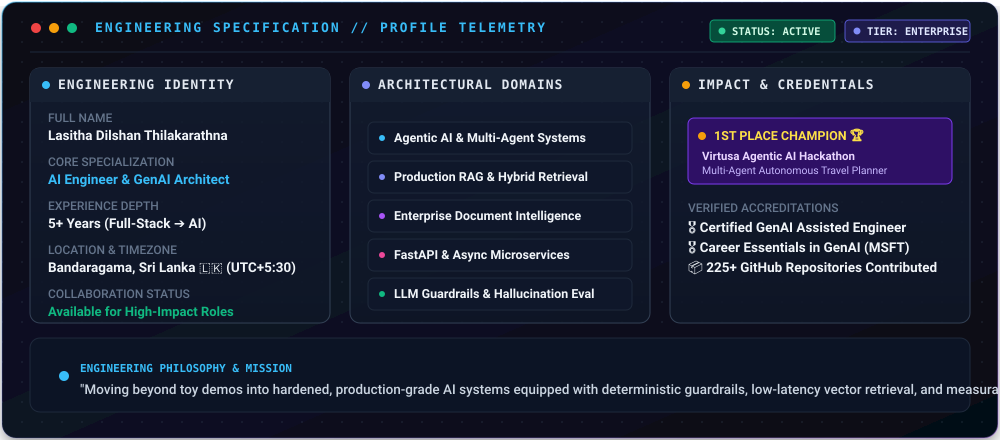
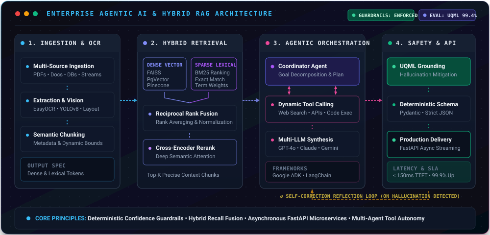
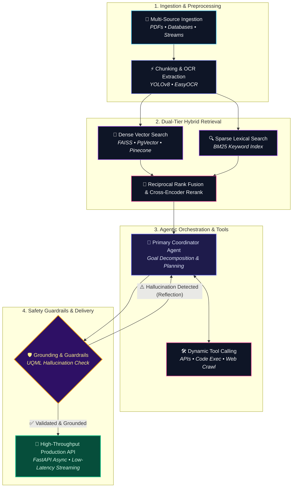

---

## 💻 Engineering Specification & Profile Telemetry

  

 

| 🌐 Parameter                   | ⚡ Operational Specification                                                |
| :----------------------------- | :-------------------------------------------------------------------------- |
| **Full Name**            | **Lasitha Dilshan Thilakarathna**                                     |
| **Core Specialization**  | **AI Engineer & Generative AI Architect**                             |
| **Experience Depth**     | **5+ Years** (Full-Stack & Cloud ➔ Production AI Systems)            |
| **Primary Accolade**     | 🏆**1st Place Winner** — Virtusa Agentic AI Hackathon                |
| **Architectural Focus**  | Autonomous Agents, Enterprise RAG, Vector Search, FastAPI Microservices     |
| **Location & Timezone**  | Bandaragama, Sri Lanka 🇱🇰`(UTC+05:30)`                                  |
| **Collaboration Status** | 🟢**Open to high-impact AI Engineering roles, consulting & research** |

---

## 🏆 Honors, Awards & Certifications

> ### 🥇 1st Place Champion — Virtusa Agentic AI Hackathon
>
> Spearheaded and architected the **Agentic AI Travel Assistant**, competing against enterprise engineering teams. Built autonomous multi-agent task delegation pipelines using Google ADK and OpenAI LLMs for dynamic itinerary planning and automated execution.
>
> 
> 
> 

 

> ### 🎓 Verified Professional Accreditations
>
> - 🎖️ **Certified GenAI Assisted Engineer** — *Virtusa*
> - 🎖️ **Career Essentials in Generative AI** — *Microsoft & LinkedIn*
> - 🎖️ **Custom GenAI Enterprise Pathway** — *Virtusa*
> - 🎖️ **GenAI Hackathon Certificate of Excellence** — *Virtusa*
>
> 
> 

---

## ⚡ Technical Arsenal & Core Stack

 

### 🤖 Generative AI, Agents & LLM Orchestration

### 🧠 Vector Intelligence & Semantic Retrieval

### ⚡ Backend Architecture & Microservices

### 💻 Modern Frontend Engineering

### ☁️ Cloud, Databases & DevOps

---

## 🚀 Featured Engineering & AI Projects

### 🏆 [Agentic AI Travel Assistant](https://github.com/lasithadilshan)

> **Autonomous Multi-Agent Travel Planning System**
> Multi-agent autonomous travel planner featuring dynamic goal decomposition, real-time itinerary orchestration, and automated planning workflows.
>
> 
> 
> 

---

### 🔬 [Deep Research Agent](https://github.com/lasithadilshan/deep-research-agent)

> **Autonomous Web Crawling, Fact Verification & Deep Research Synthesis**
> Open-source AI agent designed for autonomous deep web exploration, multi-source evidence collection, cross-verification, and structured analytical report synthesis.
>
> 
> 
> 

---

### 🤖 [Career-Ops: Open-Source AI Job Search](https://github.com/lasithadilshan/career-ops)

> **Local CLI Job Scanner & Resume Tailoring Agent**
> CLI-driven AI agent that scans job portals, synthesizes candidate experience, evaluates listings into a structured A-H report with a 1-5 suitability score, and tailors ATS-compliant CVs.
>
> 
> 
> 

---

### 🛡️ [LLM Hallucination Detector App](https://github.com/lasithadilshan/Hallucination-Detector-App)

> **UQML-Powered Model Output Uncertainty Quantification**
> Hallucination Detection platform powered by Uncertainty Quantification Machine Learning (UQML) to identify whether LLM outputs are factually grounded or hallucinated.
>
> 
> 
> 

---

### 🏢 [Enterprise Functions AI Platform](https://github.com/lasithadilshan)

> **Document Intelligence & Knowledge Discovery Engine**
> Enterprise-scale AI platform for internal process automation, multi-department knowledge retrieval, semantic search, workflow monitoring, and unstructured document ingestion.
>
> 
> 
> 

---

### 📑 [AI-Powered MLR Compliance Assistant](https://github.com/lasithadilshan)

> **Medical, Legal & Regulatory Review Agent**
> Automated compliance validation engine using OCR extraction, transcript analysis, and regulatory knowledge retrieval to streamline approval cycles and ensure audit adherence.
>
> 
> 

---

### 🚗 [Streamlit AI Parking Monitor &amp; Plate Locator](https://github.com/lasithadilshan/Streamlit-AI-Parking-Monitor-and-License-Plate-Locator-App)

> **Computer Vision & OCR Spatial Telemetry**
> End-to-end computer vision application combining YOLOv8 object tracking, EasyOCR text extraction, virtual zone mapping, and persistent SQLite telemetry into an interactive dashboard.
>
> 
> 

---

### 📜 [Policy Document Intelligence Analyzer](https://github.com/lasithadilshan/document-chatbot)

> **Conversational RAG for Complex PDF Documents**
> Conversational document intelligence system enabling domain experts to ingest multi-page policies and execute contextual Q&A with citations.
>
> 
> 

---

### 🧪 [AI-Powered QA Test Automation Suite](https://github.com/lasithadilshan)

> **Generative Test Scenario & Script Synthesis**
> Converts business requirements and Jira user stories into exhaustive edge-case test matrices, acceptance criteria, and automation-ready test scripts.
>
> 
> 

---

## 🧠 Architectural Principles & Production Standards

  

 

  
<b>📊 Click to expand interactive Mermaid architecture pipeline</b>

   

- **Deterministic Guardrails**: Zero tolerance for ungrounded hallucination in enterprise setups; applying semantic confidence scores and structured schema enforcement.
- **Hybrid Retrieval Over Naive Search**: Pairing dense vector representations (FAISS/PgVector) with sparse BM25 indexing and cross-encoder reranking for pinpoint context precision.
- **Asynchronous Scalability**: Backends engineered with FastAPI async primitives, thread-pooled IO, and resilient connection pooling.
- **Human-in-the-Loop Multi-Agent Systems**: Empowering autonomous agents with clear tool definitions, self-correction loops, and deliberate approval checkpoints.

---

## 📊 Live GitHub Analytics & Consistency

---

## 🌐 Let's Connect & Collaborate

  I am always open to discussing <b>cutting-edge Generative AI architectures, Agentic workflows, enterprise RAG consulting</b>, or full-time opportunities.

  
  
  
  
  

 

  Built with precision, passion, and engineering rigor • © <b>Lasitha Dilshan Thilakarathna</b>

