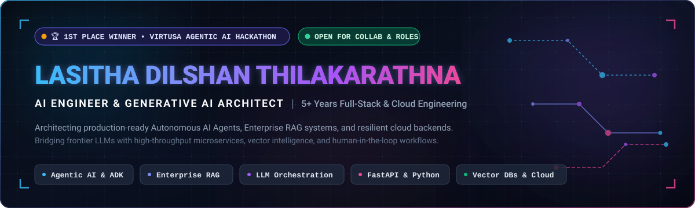

<div align="center">

  <!-- Hero Header Vector Banner -->
  <a href="https://github.com/lasithadilshan">
    
  </a>

  <!-- Dynamic Typing Subtitle -->
  <br/>
  <a href="https://github.com/lasithadilshan">
    
  </a>

  <!-- Quick Info & Live Metrics Badges -->
  <p align="center">
    <a href="https://lasithadilshan.github.io/lasitha-thilakarathna/">
      
    </a>
    <a href="https://www.linkedin.com/in/lasitha-thilakarathna-3027ab120/">
      
    </a>
    <a href="mailto:dilshantilakaratne29@gmail.com">
      
    </a>
    <a href="https://srilankantechno.blogspot.com/">
      
    </a>
    <a href="https://komarev.com/ghpvc/?username=lasithadilshan&style=for-the-badge&color=8B5CF6&label=PROFILE+VIEWS">
      
    </a>
  </p>

</div>

---

## 💻 Engineering Specification & Profile Telemetry

<div align="center">
  
</div>

<br/>

| 🌐 Parameter | ⚡ Operational Specification |
| :--- | :--- |
| **Full Name** | **Lasitha Dilshan Thilakarathna** |
| **Core Specialization** | **AI Engineer & Generative AI Architect** |
| **Experience Depth** | **5+ Years** spanning Full-Stack, Cloud & Production AI Systems |
| **Primary Accolade** | 🏆 **1st Place Winner** — Virtusa Agentic AI Hackathon |
| **Architectural Focus** | Autonomous Agents, Enterprise RAG, Vector Search, FastAPI Microservices |
| **Location & Timezone** | Bandaragama, Sri Lanka 🇱🇰 `(UTC+05:30)` |
| **Collaboration Status** | 🟢 **Open to high-impact AI Engineering roles, consulting & research** |

---

## 🏆 Honors, Awards & Certifications

<table>
  <tr>
    <td width="50%" valign="top">
      <h3>🥇 Virtusa Agentic AI Hackathon — 1st Place Winner</h3>
      <p>
        Spearheaded and architected the <b>Agentic AI Travel Assistant</b>, competing against top-tier engineering teams. Built autonomous agent delegation pipelines using Google ADK and OpenAI LLMs for dynamic itinerary planning and automated execution.
      </p>
      <p>
        
        
      </p>
    </td>
    <td width="50%" valign="top">
      <h3>🎓 Professional Accreditations</h3>
      <ul>
        <li>🎖️ <b>Certified GenAI Assisted Engineer</b> — <i>Virtusa</i></li>
        <li>🎖️ <b>Career Essentials in Generative AI</b> — <i>Microsoft & LinkedIn</i></li>
        <li>🎖️ <b>Custom GenAI Enterprise Pathway</b> — <i>Virtusa</i></li>
        <li>🎖️ <b>GenAI Hackathon Certificate of Excellence</b> — <i>Virtusa</i></li>
      </ul>
      <p>
        
        
      </p>
    </td>
  </tr>
</table>

---

## ⚡ Technical Arsenal & Core Stack

<div align="center">
  <a href="https://skillicons.dev">
    
  </a>
</div>

<br/>

### 🤖 Generative AI, Agents & LLM Orchestration


### 🧠 Vector Intelligence & Semantic Retrieval


### ⚡ Backend Architecture & Microservices


### 💻 Modern Frontend Engineering


### ☁️ Cloud, Databases & DevOps


---

## 🚀 Featured Engineering & AI Projects

<table>
  <thead>
    <tr>
      <th width="45%">Project &amp; Architecture</th>
      <th width="55%">Key Highlights &amp; Tech Stack</th>
    </tr>
  </thead>
  <tbody>
    <!-- Project 1: Hackathon Winner -->
    <tr>
      <td>
        <b><a href="https://github.com/lasithadilshan">🏆 Agentic AI Travel Assistant</a></b><br/>
        <i>Autonomous Multi-Agent Travel Planning System</i><br/>
        
        
      </td>
      <td>
        Multi-agent autonomous travel planner featuring dynamic goal decomposition, real-time itinerary orchestration, and automated planning workflows.<br/>
        <b>Tech:</b> Google ADK, OpenAI LLMs, Multi-Agent Architecture, Angular, FastAPI
      </td>
    </tr>
    <!-- Project 2: Career Ops -->
    <tr>
      <td>
        <b><a href="https://github.com/lasithadilshan/career-ops">🤖 Career-Ops: Open-Source AI Job Search</a></b><br/>
        <i>Local CLI Job Scanner &amp; Resume Tailoring Agent</i><br/>
        
        
      </td>
      <td>
        CLI-driven AI agent that scans job portals, synthesizes candidate experience, evaluates listings into a structured A-H report with a 1-5 suitability score, and tailors ATS-compliant CVs.<br/>
        <b>Tech:</b> Python, AI Coding CLIs (Antigravity/Claude Code), Structured Output, Prompt Engineering
      </td>
    </tr>
    <!-- Project 3: Hallucination Detector -->
    <tr>
      <td>
        <b><a href="https://github.com/lasithadilshan/Hallucination-Detector-App">🛡️ LLM Hallucination Detector App</a></b><br/>
        <i>UQML-Powered Model Output Uncertainty Quantification</i><br/>
        
        
      </td>
      <td>
        Hallucination Detection platform powered by Uncertainty Quantification Machine Learning (UQML) to identify whether LLM outputs are factually grounded or hallucinated.<br/>
        <b>Tech:</b> Python, LLMs, UQML, FastAPI, Streamlit
      </td>
    </tr>
    <!-- Project 4: Enterprise Functions AI Platform -->
    <tr>
      <td>
        <b><a href="https://github.com/lasithadilshan">🏢 Enterprise Functions AI Platform</a></b><br/>
        <i>Document Intelligence &amp; Knowledge Discovery Engine</i><br/>
        
        
      </td>
      <td>
        Enterprise-scale AI platform for internal process automation, multi-department knowledge retrieval, semantic search, workflow monitoring, and unstructured document ingestion.<br/>
        <b>Tech:</b> Angular, Python, FastAPI, RAG, FAISS, LLMs, Vector DBs
      </td>
    </tr>
    <!-- Project 5: MLR Assistant Platform -->
    <tr>
      <td>
        <b><a href="https://github.com/lasithadilshan">📑 AI-Powered MLR Compliance Assistant</a></b><br/>
        <i>Medical, Legal &amp; Regulatory Review Agent</i><br/>
        
      </td>
      <td>
        Automated compliance validation engine using OCR extraction, transcript analysis, and regulatory knowledge retrieval to streamline approval cycles and ensure audit adherence.<br/>
        <b>Tech:</b> Angular, FastAPI, RAG, FAISS Embeddings, Agent-Based Workflows
      </td>
    </tr>
    <!-- Project 6: Streamlit Parking & Plate Locator -->
    <tr>
      <td>
        <b><a href="https://github.com/lasithadilshan/Streamlit-AI-Parking-Monitor-and-License-Plate-Locator-App">🚗 AI Parking Monitor &amp; License Plate Locator</a></b><br/>
        <i>Computer Vision &amp; OCR Spatial Analysis</i><br/>
        
      </td>
      <td>
        End-to-end computer vision application combining YOLOv8 object tracking, EasyOCR text extraction, virtual zone mapping, and persistent SQLite telemetry into an interactive dashboard.<br/>
        <b>Tech:</b> Python, YOLOv8, EasyOCR, Streamlit, OpenCV, SQLite
      </td>
    </tr>
    <!-- Project 7: Policy Document Analyzer -->
    <tr>
      <td>
        <b><a href="https://github.com/lasithadilshan/document-chatbot">📜 Policy Document Intelligence Analyzer</a></b><br/>
        <i>Conversational RAG for Complex PDF Documents</i><br/>
        
      </td>
      <td>
        Conversational document intelligence system enabling domain experts to ingest multi-page policies and execute contextual Q&amp;A with citations.<br/>
        <b>Tech:</b> Python, FastAPI, LangChain, Google Gemini, Hugging Face, FAISS, Angular
      </td>
    </tr>
    <!-- Project 8: QA Automation Suite -->
    <tr>
      <td>
        <b><a href="https://github.com/lasithadilshan">🧪 AI-Powered QA Test Automation Suite</a></b><br/>
        <i>Generative Test Scenario &amp; Script Synthesis</i><br/>
        
      </td>
      <td>
        Converts business requirements and Jira user stories into exhaustive edge-case test matrices, acceptance criteria, and automation-ready test scripts.<br/>
        <b>Tech:</b> RAG, LLMs, Prompt Engineering, Python, Workflow Automation
      </td>
    </tr>
  </tbody>
</table>

---

## 🧠 Architectural Principles & Production Standards

```
  ┌───────────────────┐     ┌───────────────────────┐     ┌───────────────────────┐
  │ Context Ingestion │ ──> │ Semantic Chunking &   │ ──> │ Hybrid Retrieval &    │
  │ & Unstructured Data│    │ Dense/Sparse Indexing │     │ Cross-Encoder Rerank  │
  └───────────────────┘     └───────────────────────┘     └───────────────────────┘
                                                                      │
                                                                      ▼
  ┌───────────────────┐     ┌───────────────────────┐     ┌───────────────────────┐
  │ Auditable Output  │ <── │ Guardrails & Factual  │ <── │ Multi-Agent Reasoning │
  │ & Production API  │     │ Grounding Validation  │     │ & LLM Synthesis       │
  └───────────────────┘     └───────────────────────┘     └───────────────────────┘
```

- **Deterministic Guardrails**: Zero tolerance for ungrounded hallucination in enterprise setups; applying semantic confidence scores and structured schema enforcement.
- **Hybrid Retrieval Over Naive Search**: Pairing dense vector representations (FAISS/PgVector) with sparse BM25 indexing and cross-encoder reranking for pinpoint context precision.
- **Asynchronous Scalability**: Backends engineered with FastAPI async primitives, thread-pooled IO, and resilient connection pooling.
- **Human-in-the-Loop Multi-Agent Systems**: Empowering autonomous agents with clear tool definitions, self-correction loops, and deliberate approval checkpoints.

---

## 📊 Live GitHub Analytics & Consistency

<div align="center">

  <!-- Row 1: Profile Summary Details Card (Full-width balanced banner) -->
  

  <br/><br/>

  <!-- Row 2: Streak Stats & Repos Per Language (Proportionally balanced for identical height) -->
  
  &nbsp;
  

</div>

---

## 🌐 Let's Connect & Collaborate

<p align="center">
  I am always open to discussing <b>cutting-edge Generative AI architectures, Agentic workflows, enterprise RAG consulting</b>, or full-time opportunities.
</p>

<p align="center">
  <a href="https://www.linkedin.com/in/lasitha-thilakarathna-3027ab120/" target="_blank">
    
  </a>
  &nbsp;
  <a href="https://lasithadilshan.github.io/lasitha-thilakarathna/" target="_blank">
    
  </a>
  &nbsp;
  <a href="mailto:dilshantilakaratne29@gmail.com">
    
  </a>
  &nbsp;
  <a href="https://srilankantechno.blogspot.com/" target="_blank">
    
  </a>
  &nbsp;
  <a href="https://twitter.com/dilshantilakar1" target="_blank">
    
  </a>
</p>

<br/>

<div align="center">
  <sub>Built with precision, passion, and engineering rigor • © <b>Lasitha Dilshan Thilakarathna</b></sub>
</div>
