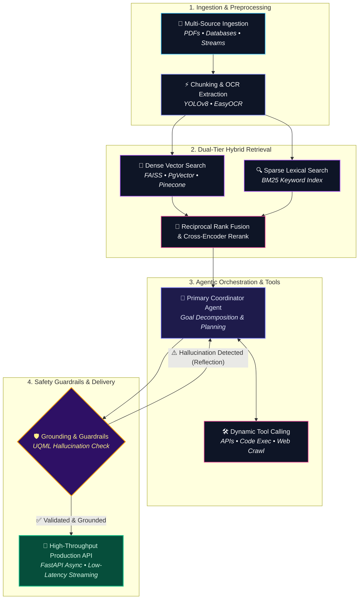
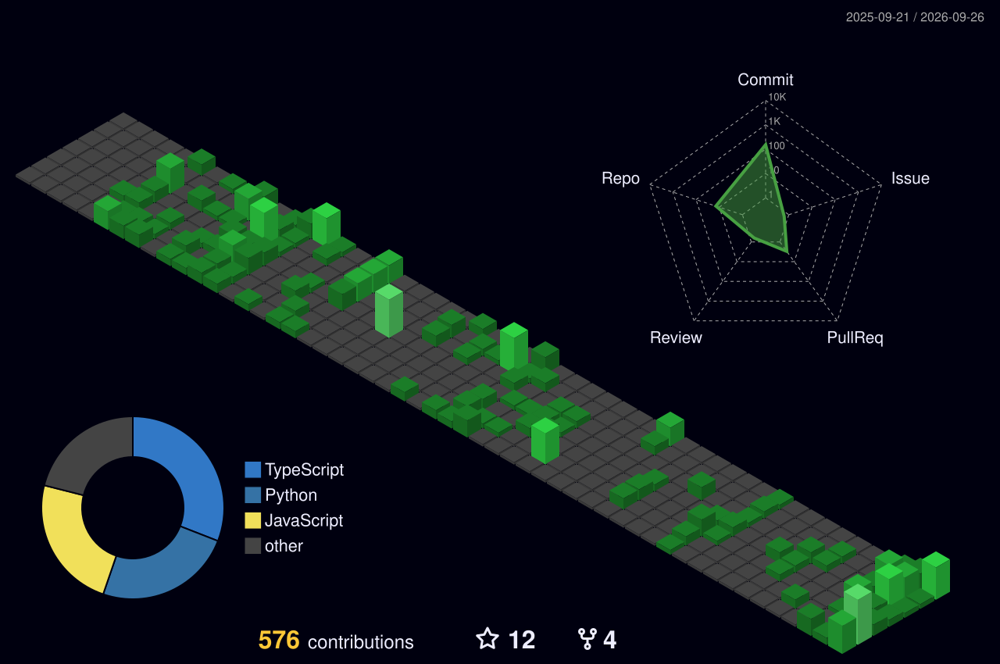

  <!-- Hero Header Vector Banner -->
  

    

  <!-- Dynamic Typing Subtitle -->
  

   

  <!-- Key Metrics Badges (Followers, Stars, Profile Views) -->
  

    
    
    
  

  <!-- Social & Network Badges -->
  

    
    
    
    
    
  

---

## 💻 Engineering Specification & Profile Telemetry

  

 

| 🌐 Parameter                   | ⚡ Operational Specification                                                |
| :----------------------------- | :-------------------------------------------------------------------------- |
| **Full Name**                  | **Lasitha Dilshan Thilakarathna**                                           |
| **Core Specialization**        | **AI Engineer & Generative AI Architect**                                   |
| **Experience Depth**           | **5+ Years** (Full-Stack & Cloud ➔ Production AI Systems)                  |
| **Primary Accolade**           | 🏆 **1st Place Winner** — Virtusa Agentic AI Hackathon                      |
| **Architectural Focus**        | Autonomous Agents, Enterprise RAG, Vector Search, FastAPI Microservices     |
| **Location & Timezone**        | Bandaragama, Sri Lanka 🇱🇰 `(UTC+05:30)`                                        |
| **Collaboration Status**       | 🟢 **Open to high-impact AI Engineering roles, consulting & research**       |

---

## 🐍 Contribution Graph

<picture>
  <source media="(prefers-color-scheme: dark)" srcset="./assets/snake-dark.svg" />
  <source media="(prefers-color-scheme: light)" srcset="./assets/snake.svg" />
  
</picture>

---

## 🏆 Honors, Awards & Certifications

> ### 🥇 1st Place Champion — Virtusa Agentic AI Hackathon
>
> Spearheaded and architected the **Agentic AI Travel Assistant**, competing against enterprise engineering teams. Built autonomous multi-agent task delegation pipelines using Google ADK and OpenAI LLMs for dynamic itinerary planning and automated execution.
>
> 
> 
> 

 

> ### 🎓 Verified Professional Accreditations
>
> - 🎖️ **Certified GenAI Assisted Engineer** — *Virtusa*
> - 🎖️ **Career Essentials in Generative AI** — *Microsoft & LinkedIn*
> - 🎖️ **Custom GenAI Enterprise Pathway** — *Virtusa*
> - 🎖️ **GenAI Hackathon Certificate of Excellence** — *Virtusa*
>
> 
> 

---

## 🚀 Featured AI Products & Engineering Systems

| | Product / System | Description | Status |
|:--:|---|---|:---:|
| 🏆 | [**Agentic AI Travel Assistant**](https://github.com/lasithadilshan) | Autonomous multi-agent travel planning system featuring dynamic goal decomposition, real-time itinerary orchestration, and automated execution workflows. | `1st Place Champion` |
| 🔬 | [**Deep Research Agent**](https://github.com/lasithadilshan/deep-research-agent) | Autonomous web crawling, multi-source evidence extraction, factual cross-verification, and structured research report synthesis. | `Open Source` |
| 🤖 | [**Career-Ops**](https://github.com/lasithadilshan/career-ops) | Local CLI agent that scans job portals, synthesizes candidate experience, scores listing fit (A-H), and tailors ATS-compliant CVs. | `Open Source` |
| 🛡️ | [**LLM Hallucination Detector**](https://github.com/lasithadilshan/Hallucination-Detector-App) | UQML-powered output uncertainty quantification platform evaluating whether LLM responses are factually grounded or hallucinated. | `Open Source` |
| 🏢 | [**Enterprise Functions AI Platform**](https://github.com/lasithadilshan) | Document intelligence & knowledge discovery engine for cross-department semantic search, workflow automation, and unstructured ingestion. | `Enterprise` |
| 📑 | [**AI MLR Compliance Assistant**](https://github.com/lasithadilshan) | Automated compliance validation engine using OCR extraction, transcript analysis, and regulatory knowledge retrieval to streamline review cycles. | `Enterprise` |
| 🚗 | [**Streamlit AI Parking Monitor**](https://github.com/lasithadilshan/Streamlit-AI-Parking-Monitor-and-License-Plate-Locator-App) | Computer vision application combining YOLOv8 vehicle tracking, EasyOCR license plate recognition, virtual zones, and SQLite telemetry. | `Open Source` |
| 📜 | [**Policy Document Analyzer**](https://github.com/lasithadilshan/document-chatbot) | Conversational document intelligence platform enabling domain experts to ingest multi-page policies and execute contextual Q&A with citations. | `Open Source` |
| 🧪 | [**AI QA Automation Suite**](https://github.com/lasithadilshan) | Generative test scenario & script synthesis engine transforming Jira user stories into edge-case test matrices and automation scripts. | `Enterprise` |

---

## ⚡ Technical Arsenal & Core Stack

### 🤖 Generative AI, Agents & LLM Orchestration

### 🧠 Vector Intelligence & Semantic Retrieval

### ⚡ Backend Architecture & Microservices

### 💻 Modern Frontend Engineering

### ☁️ Cloud, Databases & DevOps

---

## 🧠 Architectural Principles & Production Standards

  

 

  
<b>📊 Click to expand interactive Mermaid architecture pipeline</b>

   

- **Deterministic Guardrails**: Zero tolerance for ungrounded hallucination in enterprise setups; applying semantic confidence scores and structured schema enforcement.
- **Hybrid Retrieval Over Naive Search**: Pairing dense vector representations (FAISS/PgVector) with sparse BM25 indexing and cross-encoder reranking for pinpoint context precision.
- **Asynchronous Scalability**: Backends engineered with FastAPI async primitives, thread-pooled IO, and resilient connection pooling.
- **Human-in-the-Loop Multi-Agent Systems**: Empowering autonomous agents with clear tool definitions, self-correction loops, and deliberate approval checkpoints.

---

## 📊 GitHub Analytics & Live Activity

  
  

 

  
<b>3D Contribution Graph</b>

   
  

    
  

 

  
<b>📈 Click to view detailed language & profile telemetry</b>

   
  

    
      
    
    
  

 

### 💡 Daily Engineering Wisdom

---

## 🌐 Let's Connect & Collaborate

  I am always open to discussing <b>cutting-edge Generative AI architectures, Agentic workflows, enterprise RAG consulting</b>, or full-time opportunities.

  
  
  
  
  

 

<!-- Footer Waving Capsule -->

  

  **Bandaragama, Sri Lanka** | AI Engineer & Generative AI Architect | 1st Place Champion, Virtusa Hackathon

  Built with precision, passion, and engineering rigor • © <b>Lasitha Dilshan Thilakarathna</b>

